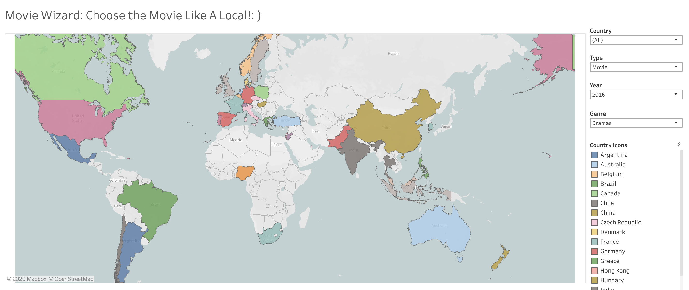
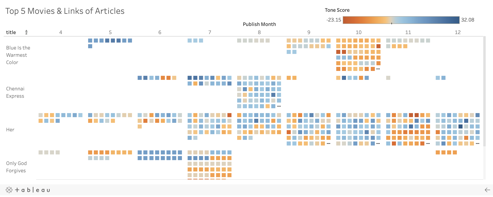
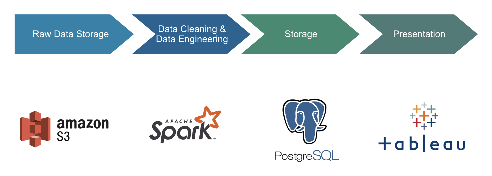

#  Movie Wizard
> ***Choose The Movie Like A Local! (Foreign Movie Recommendation Tool)***

This is a project completed as part of the Insight Data Engineering program (New York, Winter 2020).
Visit (http://datascalableplatform.me/) for the interactive webpage. You can also watch a short demo [here](https://www.youtube.com/watch?v=AHPhHpsh51E).

***

## Introduction
People with an interest in watching a foreign movie might not know the movie market of that specific foreign country well enough to make an informed choice due to the obstacle of language and culture or a delay of a movie becoming international. 
But the local media offers the most up-to-date insights and reviews of the film. 
To help break the language and cultural barriers, this recommendation platform helps suggest users foreign movies based on the knowledge and insights of the local film reviewers





## Project Structure
```
.
├── README.md
├── frontend
│   ├── app.py
│   └── templates
│       └── tab.html
├── images
│   ├── movie-geo-distribution.png
│   ├── pipeline.png
│   └── review-tone-distribution.png
├── ingestion
│   ├── data
│   │   └── netflix_titles.csv
│   └── s3_gdelt.sh
├── postgres
│   ├── README.md
│   └── postgres_query.sql
└── spark
    ├── README.md
    ├── config.ini
    ├── gdelt_transformers.py
    └── movie_transformers.py
```
## Data Description
The Global Database of Events, Language, and Tone (GDELT) Project monitors the world's broadcast, print, and web news from nearly every corner of every country in over 100 languages.
Being daily updated, the GDELT 1.0 Event Database contains over a quarter-billion records organized into a set of tab-delimited files by date. 
News data from GDELT GKG 1.0 from 2013 - 2020 and Netflix movie data are being used in this project. 
The sentiment scores (or "tones") and the trending scores (or "number of articles mentioned") are obtained from GDELT to rank and sort each movie's popularity. 

## Data Sources
1. [GDELT] (http://data.gdeltproject.org/events/index.html), for period from April 2013 to January 2020 (~300 GB)
2. [Netflix] (https://www.kaggle.com/shivamb/netflix-shows), including 6234 movies/TV shows from 118 countries, for period 2010 - 2020

## Data Pipeline



## Requirments
* Python 3.7
* Amazon AWS Account

## Installation
Install and configure [AWS CLI](https://aws.amazon.com/cli/) and [Pegasus](https://github.com/InsightDataScience/pegasus) on your local machine.
Clone the RxMiner project to your local computer or `m4.4xlarge` EC2 instance and install awscli.

```bash
$ git clone https://github.com/tying21/foreign-movie-recommendation-tool.git
$ pip install awscli
```
Next add the following credentials as environment variables to your `~/.bash_profile`.

```bash
# AWS Credentials
export AWS_BUCKET_NAME=XXXX
export AWS_ACCESS_KEY_ID=XXXX
export AWS_SECRET_ACCESS_KEY=XXXX

# PostgreSQL configuration
export POSTGRESQL_USER=XXXX
export POSTGRESQL_PASSWORD=XXXX
export POSTGRESQL_HOST_IP=XXXX
export POSTGRESQL_PORT=XXXX
export POSTGRESQL_DATABASE=XXXX

# Upgrade Spark default python version to 3.7
export PYSPARK_PYTHON=XXXX
export PYSPARK_DRIVER_PYTHON=XXXX
```
Source the `.bash_profile` when finished.

```bash
$ source ~/.bash_profile
```

Then import data into S3 bucket.

```bash
$ . ./ingestion/s3_gdelt.sh
```

## Configurations
Configuration settings for PostgreSQL and AWS S3 bucket are stored in the respective files in `./spark/config.ini`.
Replace the names and paths of your S3 bucket `config/s3config.ini`.
Replace the names and paths of your S3 bucket `ingestion/s3_gdelt.sh`.

## Get Started
Open the website at [http://datascalableplatform.me/](http://datascalableplatform.me/). Two graphs are shown on the interactive dashboard. 
On the top is a world map, with countries highlighted and filtered by different release year, genre, type. 
The bottom graph shows the Top 5 movies recommended by trending scores, and articles links of each movie through out the year. 
Color blue on the spectrum bar of "Tone Score" means positive tone, color orange means negative tone.
