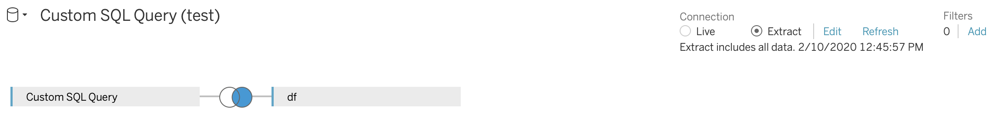

#### Tables Names
df: joined table with GDELT and Netflix

newdb_movie: movie look-up table

Both tables are stored in PostgreSQL database.

#### Get Started
Connect Tableau server to PostgreSQL database, apply "Custom SQL Query" by `./postgres_query.sql` and inner join the two tables. 

